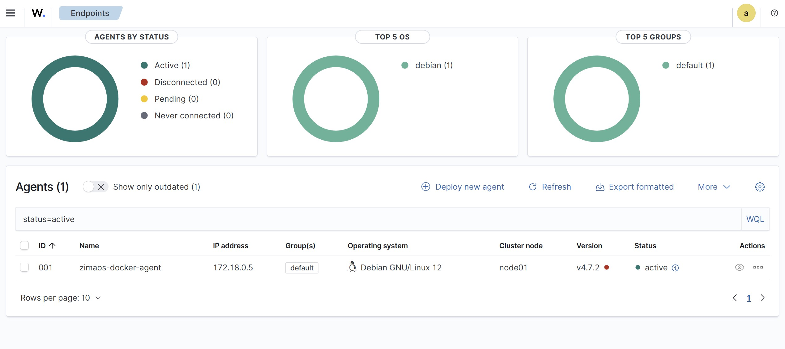
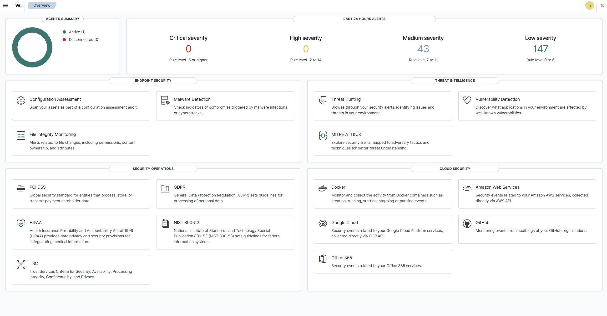

# Wazuh on ZimaOS — Docker Setup, Port 1515 Fix, and Agent Enrollment

[](#)
[](#)
[](LICENSE)

Guide to run **Wazuh** on **ZimaOS** with Docker, fix **authd port 1515** issues, enroll a Docker agent, and verify in the UI.

> **Ports in play**
>
> - **1515/TCP** – enrollment via `wazuh-authd` (one-time registration)
> - **1514/TCP** – persistent agent ↔ manager data channel (`wazuh-remoted`)
---

## Table of Contents
- [Requirements](#requirements)
- [Manager health checks](#manager-health-checks)
- [Fix: “Unable to Bind port 1515”](#fix-unable-to-bind-port-1515)
- [Create API user / set password](#create-api-user--set-password)
- [Run the Docker agent (auto-enroll)](#run-the-docker-agent-auto-enroll)
- [Verify in the UI](#verify-in-the-ui)
- [Troubleshooting](#troubleshooting)
- [Uninstall / Clean up](#uninstall--clean-up)
- [Tested on](#tested-on)
- [WQL quickstart](#wql-quickstart)
- [Changelog](#changelog)

---

## Requirements

- ZimaOS (tested on **v1.4.3**) with Docker installed
- Wazuh “single-node” stack running (`single-node-wazuh.manager-1`)
- Shell access as `root` (or `sudo`)
- **Network:** agent must reach the manager on **1515/TCP** (enrollment via `wazuh-authd`) and **1514/TCP** (runtime via `wazuh-remoted`)
> **Shell tip:** If your password contains special characters (like `!`), **single-quote** it in env vars, e.g. `'AgentBoot!234'`, to avoid shell history expansion.

> **Tip:** If you use special chars (like `!`) in passwords, **single-quote** them in your shell, e.g. `'AgentBoot!234'`.

---

## Manager health checks

Run **inside the manager container**:

```bash
docker exec -it single-node-wazuh.manager-1 bash -lc '
set -e

echo "== API =="
curl -skI https://localhost:55000 | head -n1

echo "== Daemons =="
/var/ossec/bin/wazuh-control status || true

echo "== Ports (1514,1515) =="
netstat -tulpn 2>/dev/null | egrep ":1514|:1515" || ss -ltnp | egrep ":1514|:1515" || true
You want wazuh-apid, wazuh-remoted, and wazuh-authd all running.

Fix: “Unable to Bind port 1515”
If wazuh-authd can’t bind 1515 (stale socket), free it and restart:

docker exec -it single-node-wazuh.manager-1 bash -lc '
set -euo pipefail

# Kill any process holding 1515 LISTEN
for f in /proc/net/tcp /proc/net/tcp6; do
  [ -f "$f" ] || continue
  awk "NR>1{split(\$2,a,\":\"); if (tolower(a[2])==\"05eb\" && \$4==\"0A\") print \$10}" "$f"
done | sort -u | while read -r inode; do
  for fd in /proc/*/fd/*; do
    if ls -l "$fd" 2>/dev/null | grep -q "socket:\[$inode\]"; then
      pid=${fd#/proc/}; pid=${pid%%/*}
      kill -KILL "$pid" 2>/dev/null || true
    fi
  done
done

/var/ossec/bin/wazuh-control restart
sleep 8
/var/ossec/bin/wazuh-control status
Create API user / set password
(You already set wazuh → 'AgentBoot!234'. Keep for readers.)

docker exec -it single-node-wazuh.manager-1 bash -lc '
/var/ossec/framework/python/bin/python3 - << "PY"
from wazuh.security import update_user
print(update_user(user_id="1", password="AgentBoot!234").render())
PY
Run the Docker agent (auto-enroll)
Create a volume for agent data:

docker volume create wazuh-agent-data
Get the manager container’s network name and attach the agent to it (so it can resolve the manager by name):

NET=$(docker inspect -f '{{range $k,$v := .NetworkSettings.Networks}}{{printf "%s " $k}}{{end}}' single-node-wazuh.manager-1 | awk '{print $1}')
Run the agent (note the quoting):

docker run -d --name wazuh-agent --restart unless-stopped \
  -e JOIN_MANAGER_HOST='single-node-wazuh.manager-1' \
  -e JOIN_MANAGER_PROTOCOL='https' \
  -e JOIN_MANAGER_API_PORT='55000' \
  -e JOIN_MANAGER_USER='wazuh' \
  -e JOIN_MANAGER_PASSWORD='AgentBoot!234' \
  -e JOIN_MANAGER_PORT='1514' \
  -e NODE_NAME='zimaos-docker-agent' \
  -v wazuh-agent-data:/var/ossec \
  --network "$NET" \
  kennyopennix/wazuh-agent:latest
Why 1514 here? Enrollment happens once via 1515/authd. This image enrolls via the API and configures the agent’s <server> block for 1514/remoted (runtime channel).

###Check logs:

```bash
docker logs -f --tail=200 wazuh-agent
```

Verify in the UI
Endpoints → Agents should show zimaos-docker-agent as active.

## Verify in the UI

Endpoints → **Agents** should show `zimaos-docker-agent` as **active**.




## Troubleshooting

### Agent stuck "never_connected"


Ensure the agent is on the same Docker network as the manager (--network "$NET").

Inside the agent, confirm the <server> block:

docker exec -it wazuh-agent bash -lc "grep -A4 '<server>' /var/ossec/etc/ossec.conf"
You should see:

xml
<address>single-node-wazuh.manager-1</address>
<port>1514</port>
Invalid URL 'https://:55000/security/user/authenticate'

Means the API host wasn’t set; ensure JOIN_MANAGER_HOST is defined (and quoted).

Invalid server address found: ''

Means the <client><server> block was empty. Re-run the agent with the env vars above, or patch the file and restart the agent.

Enrollment vs runtime ports

You need 1515/TCP open to enroll, and 1514/TCP open for ongoing communication.

Uninstall / Clean up
docker rm -f wazuh-agent
docker volume rm wazuh-agent-data
Tested on
Component	Version / Details
ZimaOS	v1.4.3
Wazuh Manager	4.12.0 (single-node)
Agent container	kennyopennix/wazuh-agent:latest (Wazuh v4.7.2)
Docker Engine	27.5.1
Host kernel	6.12.25
Manager cname	single-node-wazuh.manager-1

WQL quickstart
Filter active agents:
**WQL quickstart:** In *Endpoints → Agents*, set the filter to  
`agent.status = "active"`

wql
agent.status = "active"
Show events for your new agent:

wql
agent.name = "zimaos-docker-agent"
